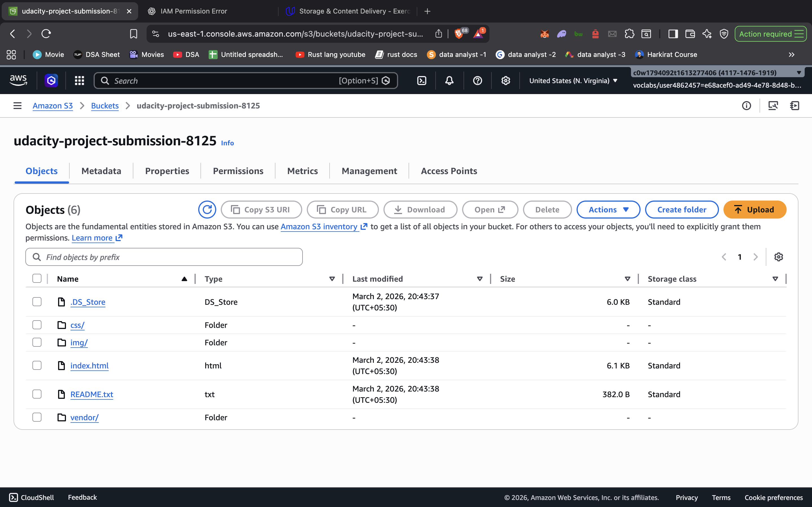
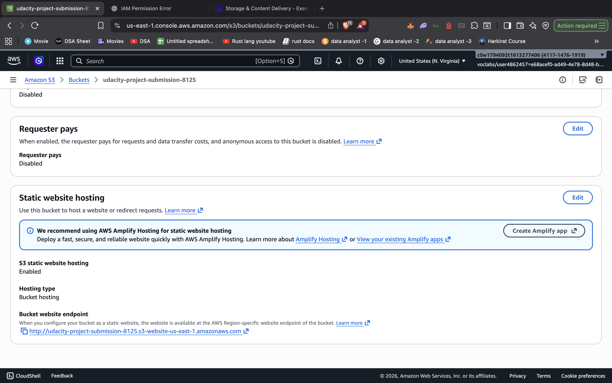
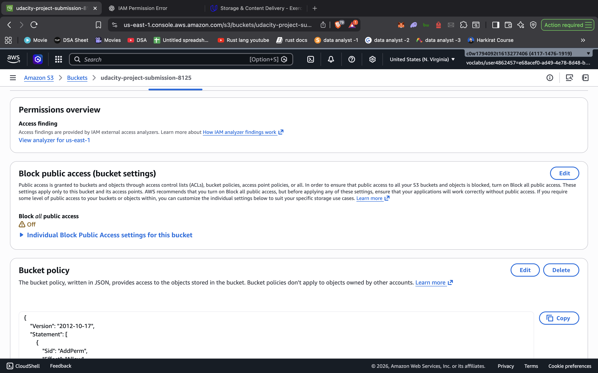
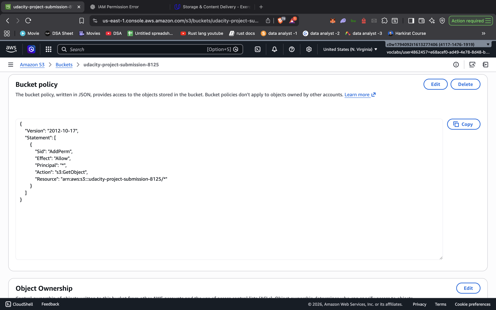
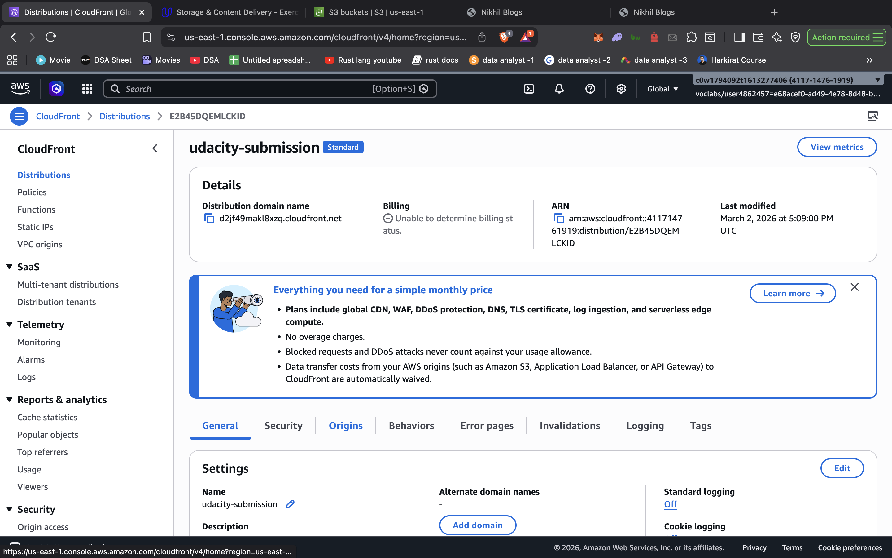
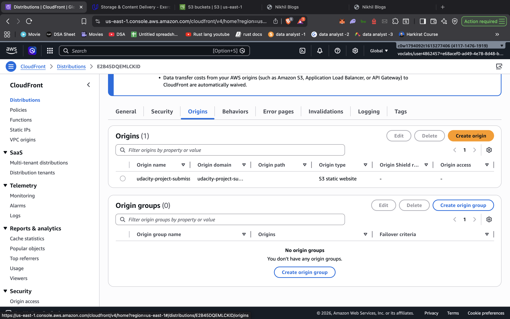

# Project Images

# Website Files

## S3 Bucket named udacity-project-submission-8125

## All the website files uploaded to the newly created S3 bucket.

## S3 bucket configured to support static website hosting.

## Allowed public access

## Bucket Policy for the S3 bucket

# Website Distribution

## CloudFront Distribution state column
### CloudFront status : Enabled 
#### Distribution Id : E2B45DQEMLCKID

## Cloudfront

## Cloudfront configured to retrieve and distribute website files.

# Web Browser Access
## Accessible to anyone on the Internet via a web browser.

## Cloudfront Link 
https://d2jf49makl8xzq.cloudfront.net/

## Website-endpoint URL
https://udacity-project-submission-8125.s3.us-east-1.amazonaws.com/index.html